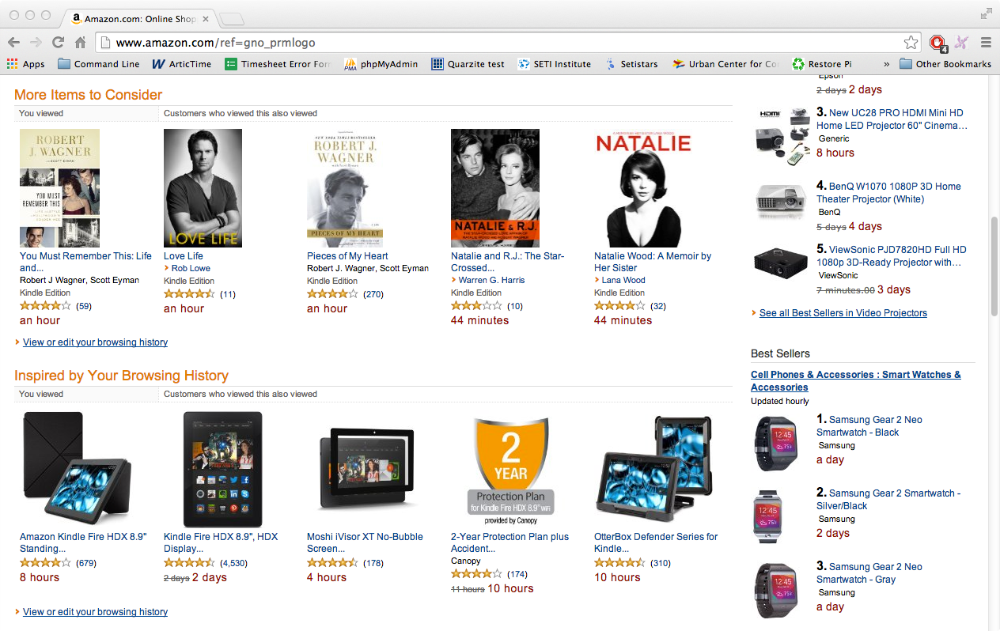

# Amazon Minimum Wage

A Google Chrome browser extension that replaces prices on [Amazon](http://amazon.com) with the time it would take to earn the equivalent monetary amount making minimum wage.

The minimum wage this extension uses is based on your location and minimum wage records from 2013.

## Installation

1. [Download](http://brannondorsey.com/files/minimumwage/extension.crx) the extension.
2. Open google chrome and enter `chrome://extensions` into the URL bar.
3. Drag the extension.crx file onto your browser window to install.

**Note:** this extension will not be maintained.
